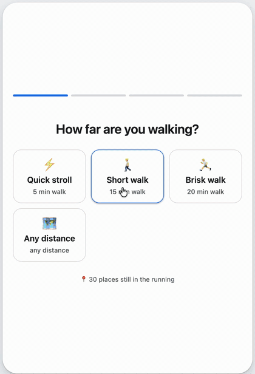
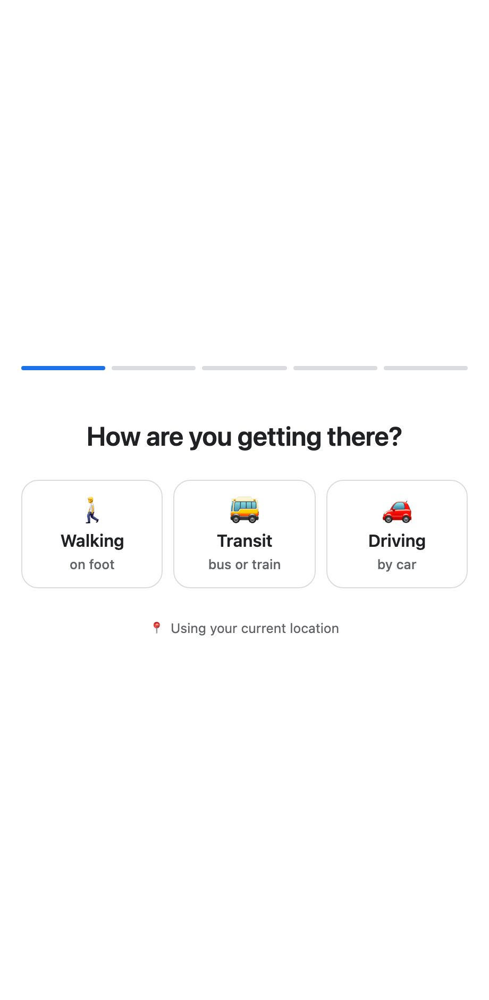
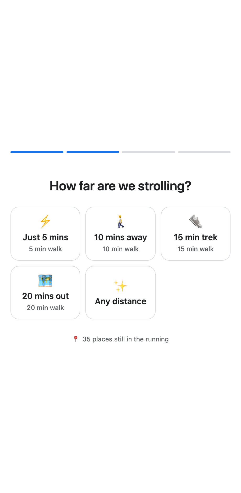
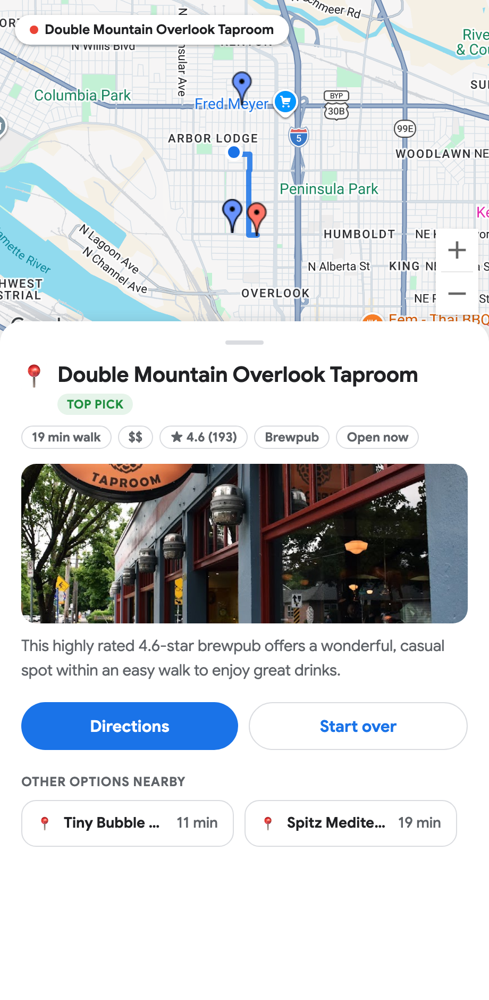

# Mood Food Finder

Picks somewhere to eat without making you type anything. You tap a few tiles, it narrows
down real restaurants around you, and shows the winner on a map with the route to get there.

<p align="center">
  
</p>

The point of the project is that **the quiz is built from reality, not hard-coded**. Before
it asks anything it looks up what's actually nearby, then only offers options that have
places behind them. If nothing is a 5-minute walk away, it never offers "5 min".

<p align="center">
  
  
  
</p>

## How it works

```
browser ──▶ /api/start ──▶ travel mode?  ──▶ Places (New) ──▶ candidates + travel times
                                │
        ◀── question ───────────┤ Gemini picks the next filter + writes the tile copy
                                │
browser ──▶ /api/answer ────────┤ deterministic filtering in Python
                                │
        ◀── results ────────────┴ Gemini ranks survivors, Places photo, Routes API path
```

**1. Ask how you're travelling.** Before anything is looked up, the quiz asks whether you're
walking, taking transit, or driving — because the answer sets the search radius. Half an hour
on foot reaches 2.4 km; half an hour of driving reaches 15 km. **Transit is only offered where
it actually runs**: the server probes the Routes API for a transit trip nearby, and omits the
option where nothing comes back.

**2. Survey.** `/api/start` searches Places API (New) around your location — twice, for
`restaurant` and `cafe`, because the API caps each search at 20 results — using the radius that
suits your mode. Each place gets a travel-time estimate, and each mode gets its own ladder of
thresholds to offer (5–30 min on foot, 10–45 by transit, 10–30 driving).

**3. Compute what's answerable.** `quiz.py` turns that candidate list into the filters that
still *discriminate*: distance thresholds, price levels, cuisines, open-now, well-rated. An
option is dropped if nothing sits behind it, and a whole question is dropped if it has fewer
than two live options. This is what makes dead-end taps impossible.

**4. Let Gemini choose the question.** The model receives only that validated menu and picks
which filter to ask about next, writing the title, labels and emoji. Its labels are matched
back to the server's options positionally, so the wording is free but the *filter* can't be
invented. Distance is forced to come first, right after the mode that gives it meaning — it
cuts the field hardest and takes no thought to answer.

**5. Narrow deterministically.** Filtering happens in Python, not in the model. Questions stop
once four or fewer candidates remain, or after four questions.

**6. Show the answer.** Gemini ranks the survivors with a one-line reason each, grounded in
real fields. The results screen plots them on a Maps JavaScript map, marks where you started,
draws the real path from the Routes API in your chosen mode, and shows a Places photo.

## Google Maps Platform usage

| API | Used for |
|---|---|
| Places API (New) — `searchNearby` | The candidate survey that every question is derived from |
| Places API (New) — photo media | The image on the result card |
| Routes API | The path and its true duration, plus probing whether transit runs here |
| Maps JavaScript API | The map, markers, and polyline |

Two cost guards, since these are billed per call:

- **Route legs are cached per session**, so tapping between pins doesn't re-bill. A repeat
  lookup returns in ~2 ms.
- **Photos are resolved only for the places shown** (top 6), in parallel.

Photo URLs are fetched server-side with `skipHttpRedirect=true`, which returns the
`googleusercontent.com` link as JSON. The image loads in the browser without the API key ever
appearing in a URL.

### A note on travel times

The quiz filters on an estimate rather than a real route, because routing all ~40 candidates up
front would mean ~40 billed calls per quiz. The estimate scales crow-flies distance by a
**circuity factor of 1.3** (streets don't run diagonally) and adds a fixed **8-minute overhead
for transit** — waiting for the bus dominates a short trip, and without it a 12-minute ride
reads as 4.

The speeds are fitted against real Routes results, not guessed, because an optimistic estimate
would offer a "20 min ride" for a trip that takes an hour — the exact failure this project
exists to avoid. Measured mean error across modes is ~4 minutes; walking and driving land on the
nose, and transit errs long rather than short. **The selected place then gets a real routed
time**, and that is what the card displays.

## Performance

A full quiz used to take **20.6 s** of waiting; it now takes **4.8 s**. Profiling showed the
Google APIs were never the problem — Places is ~257 ms, Routes ~71 ms, photos ~77 ms — while
the model calls were **97% of the total**. So the work went there:

| Change | Effect |
|---|---|
| `gemini-3.5-flash-lite` instead of full flash | 3–5× faster per call, same output quality measured over repeated runs |
| Mode question written by hand, not the model | First paint **4008 ms → 135 ms** |
| Ranking returns a candidate *index*, not a place ID | Faster to emit, and stops the occasional hallucinated ID |
| Photos + the top pick's route resolved concurrently | The results screen draws its path on first paint |
| Geolocation accepts a cached fix | Removes a multi-second stall before the first request |

The lite model was checked against the full one before switching, not assumed: identical
usable-output rates on the question prompt, and better coverage on the ranking prompt. Setting
a thinking level was tried and **does not work** through the Interactions API — MINIMAL and HIGH
produced identical latency, so it is silently ignored.

## Project layout

| File | Role |
|---|---|
| `app.py` | Flask routes, session state, and the two Gemini calls |
| `maps.py` | Places survey, photo resolution, Routes lookups, haversine distance |
| `quiz.py` | Works out which questions still discriminate — no network, no LLM |
| `templates/index.html` | The whole frontend: tiles, map, markers, route, bottom sheet |

## Setup

1. Put your Gemini API key in `.env`:
   ```
   GEMINI_API_KEY=your-key-here
   ```
2. Put your Google Maps Platform key in `.env`:
   ```
   GOOGLE_MAPS_API_KEY=your-key-here
   ```
   The project needs **Maps JavaScript API**, **Places API (New)**, and **Routes API** enabled,
   with billing on. Restrict the key to those services — and add an HTTP-referrer restriction
   before deploying anywhere, since the Maps JS key is necessarily visible in the browser.
3. Install deps (uses [uv](https://docs.astral.sh/uv/)):
   ```
   uv sync
   ```

## Run

```
uv run app.py
```

Open http://127.0.0.1:5001. The app asks for geolocation and falls back to downtown LA if you
decline.

## Limitations

- **Sessions live in an in-memory dict**, so this is single-process only. Running multiple
  workers would need Redis or signed client-side state.
- **The survey is capped at 40 places** (two 20-result searches), so in a dense city the quiz
  narrows a sample rather than every option.
- Places sometimes returns non-restaurants that are tagged as serving food — a grocery with a
  deli counter can surface as a result.
- **Transit estimates are the least reliable**, since real journeys depend on the timetable and
  the time of day. Transit availability is probed once per session from your starting point, so
  it reflects the area rather than the specific trip.
